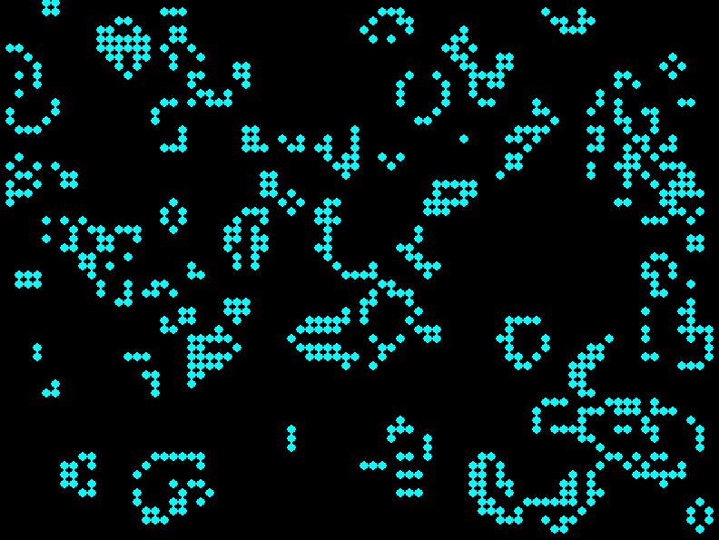

Conway's Game of Life
=====================

Simple pygame implementation of Conway's Game of Life.

.. contents::

Screenshot
----------

Installation
------------

Install with pip::

  pip install nanolife

Install from source::

  python setup.py install

Running
-------

Run via launch script installed with pip package::

  nanolife

Run as a Python module::

  python -m nanolife

Using inside of code
--------------------

To import the class in to your own code::

  from nanolife.LifeGame import LifeGame
  LifeGame().run()

Controls
--------

There are a couple keybinds available:

- q - Quit
- s - Start/stop (toggle pause)
- r - Randomize the grid

Links
-----------

- https://github.com/DevDungeon/NanoLifePy
- https://pypi.org/project/nanolife/

Contact
-------

NanoDano <nanodano@devdungeon.com>

